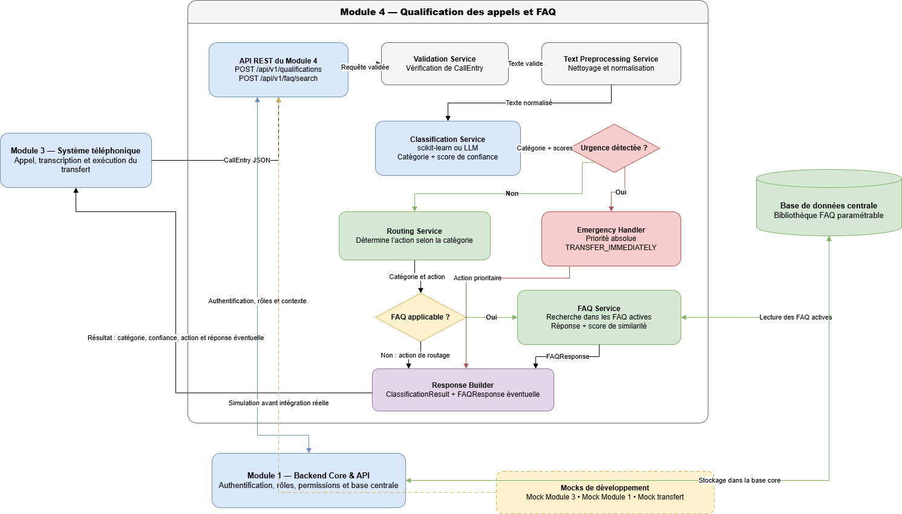

# Architecture générale du Module 4

## 1. Objectif

Ce document présente l’architecture générale du Module 4 —
Qualification des appels et FAQ.

Le module est chargé de recevoir une demande textuelle, de la classifier,
de détecter les urgences, de rechercher une éventuelle réponse FAQ et de
retourner une action au module appelant.

## 2. Diagramme d’architecture

## 3. Vue générale

Le Module 3 transmet au Module 4 un texte provenant de la transcription
d’un appel.

Le Module 4 traite cette demande à travers plusieurs composants internes :

1. API REST ;
2. service de validation ;
3. service de prétraitement ;
4. moteur de classification ;
5. gestionnaire d’urgence ;
6. service de routage ;
7. gestionnaire FAQ ;
8. service d’historisation.

## 4. Composants internes

### 4.1 API REST

L’API REST constitue le point d’entrée du Module 4.

Responsabilités :

- recevoir les requêtes du Module 3 ;
- vérifier le format général des données ;
- appeler les composants internes ;
- construire la réponse finale ;
- retourner la réponse ou l’action de transfert.

### 4.2 Validation Service

Responsabilités :

- vérifier que le texte est présent ;
- vérifier que le texte n’est pas vide ;
- vérifier le type des champs ;
- vérifier la longueur de la demande ;
- retourner une erreur structurée en cas de données invalides.

### 4.3 Text Preprocessing Service

Responsabilités :

- conserver le texte original ;
- supprimer les espaces inutiles ;
- normaliser le texte ;
- préparer les données pour le modèle de classification.

### 4.4 Classification Engine

Responsabilités :

- charger le modèle de classification ;
- prédire la catégorie principale ;
- calculer le score de confiance ;
- retourner les scores par catégorie lorsque cela est possible ;
- indiquer le nom et la version du modèle ;
- mesurer le temps de traitement.

### 4.5 Emergency Manager

Responsabilités :

- vérifier en priorité le score de la classe urgence ;
- appliquer les règles complémentaires de sécurité ;
- interrompre le flux normal lorsqu’une urgence est détectée ;
- déclencher l’action `TRANSFER_IMMEDIATELY`.

Le composant ne réalise aucun diagnostic médical.

### 4.6 Routing Service

Responsabilités :

- transformer la catégorie prédite en action métier ;
- router la demande vers le service adapté ;
- transférer les demandes inconnues vers un humain ;
- utiliser des mocks lorsque les services réels ne sont pas disponibles.

### 4.7 FAQ Manager

Responsabilités :

- rechercher uniquement dans les FAQ actives ;
- calculer un score de similarité ;
- retourner une réponse validée ;
- refuser de répondre lorsque la similarité est insuffisante ;
- transmettre la demande à un humain en cas d’incertitude.

### 4.8 History Service

Responsabilités :

- enregistrer les demandes traitées ;
- enregistrer les catégories prédites ;
- conserver les scores de confiance ;
- enregistrer les actions exécutées ;
- conserver le modèle utilisé ;
- enregistrer les réponses FAQ ;
- conserver les corrections humaines.

## 5. Composants externes

### 5.1 Module 3

Le Module 3 :

- gère l’appel téléphonique ;
- transforme la parole en texte ;
- transmet la demande au Module 4 ;
- exécute les actions de transfert demandées.

Dans le prototype, le Module 3 est simulé à l’aide d’un mock.

### 5.2 Module 1

Le Module 1 peut fournir :

- l’authentification ;
- les rôles et permissions ;
- les utilisateurs ;
- la base de données centrale ;
- les fonctions partagées.

### 5.3 Services cibles

Les services cibles peuvent inclure :

- le service de rendez-vous ;
- le service de devis ;
- le service administratif ;
- le laboratoire ;
- la pharmacie ;
- une secrétaire médicale.

## 6. Séparation entre classification et FAQ

Le moteur de classification et le gestionnaire FAQ sont deux composants
indépendants.

Le moteur de classification détermine la nature de la demande.

Le gestionnaire FAQ recherche une réponse uniquement lorsque la catégorie
et les règles de routage autorisent l’utilisation de la FAQ.

Cette séparation permet :

- de modifier la FAQ sans réentraîner le classificateur ;
- de comparer plusieurs modèles de classification ;
- de remplacer la méthode de recherche FAQ indépendamment ;
- de limiter le risque qu’une réponse FAQ soit utilisée dans une situation urgente.

## 7. Points à valider

- Le format exact transmis par le Module 3.
- Les mécanismes d’authentification.
- La base de données utilisée.
- Les seuils de confiance.
- Les catégories autorisées à utiliser la FAQ.
- La définition technique du transfert immédiat.
- Les actions réellement disponibles dans les autres modules.