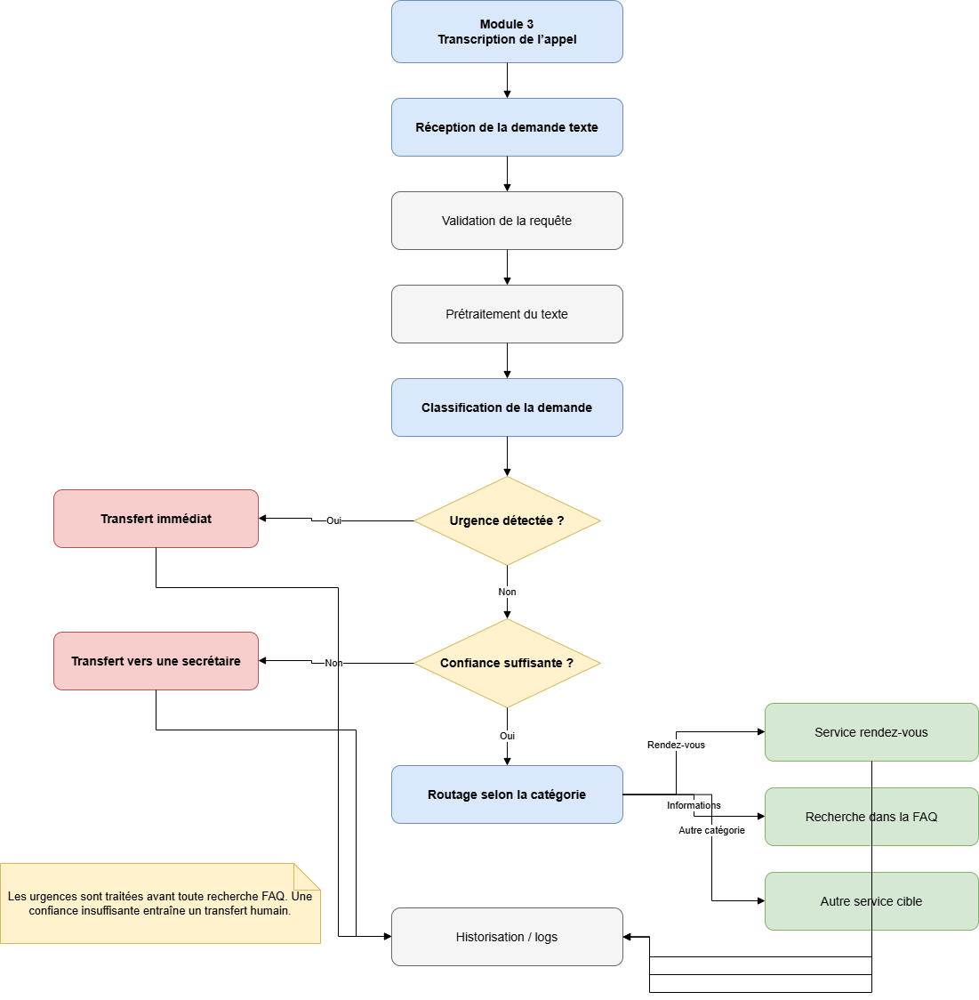
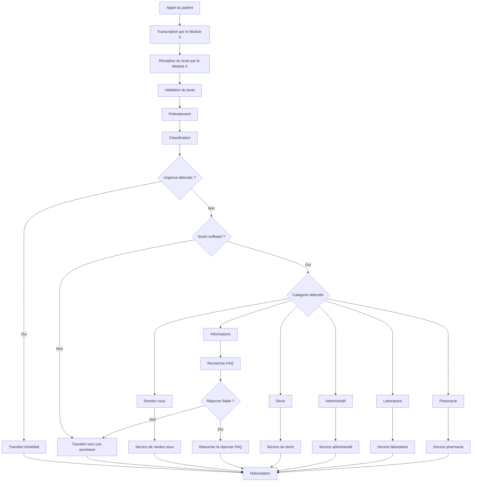

# Flux de qualification des appels

## 1. Objectif

Ce document présente le parcours fonctionnel d’une demande reçue par le
Module 4 — Qualification des appels et FAQ.

Le flux commence à la réception d’un texte issu de la transcription d’un
appel et se termine par une réponse automatique, un routage vers un service
ou un transfert vers un interlocuteur humain.

## 2. Entrée du module

Dans le système final, le Module 3 est responsable de la gestion de l’appel
et de la transcription de la voix en texte.

Le Module 4 reçoit une demande sous une forme similaire à la suivante :

```json
{
  "call_id": "CALL-0001",
  "text": "Je voudrais annuler mon rendez-vous de demain",
  "language": "fr"
}
```

Dans la première version, le Module 3 sera simulé à l’aide d’un mock.

## 3. Flux principal

### 3.1 Diagramme du flux de qualification

Le diagramme suivant présente le parcours complet d’une demande, depuis sa
réception depuis le Module 3 jusqu’à la réponse automatique, au routage vers
un service ou au transfert vers une secrétaire.



*Figure — Flux de qualification d’une demande dans le Module 4.*

### 3.2 Description textuelle du flux

```text
Appel du patient
        ↓
Transcription par le Module 3
        ↓
Réception du texte par le Module 4
        ↓
Validation de la demande
        ↓
Prétraitement du texte
        ↓
Classification
        ↓
Détection de l’urgence
        ↓
Urgence ?
├── Oui → transfert immédiat
└── Non → vérification du score de confiance
```

## 4. Routage selon la catégorie

| Catégorie | Traitement provisoire |
|---|---|
| Urgence | Transfert immédiat |
| Rendez-vous | Routage vers le service de rendez-vous |
| Devis | Routage vers le service de devis |
| Informations | Recherche dans la FAQ |
| Administratif | Routage vers le service administratif |
| Laboratoire | Routage vers le service laboratoire |
| Pharmacie | Routage vers le service pharmacie |
| Inconnue | Transfert vers une secrétaire |

Cette table est provisoire et doit être validée avec l’encadrant et les
responsables des autres modules.

## 5. Traitement des urgences

Lorsqu’une urgence potentielle est détectée :

1. le traitement normal est interrompu ;
2. aucune recherche dans la FAQ n’est réalisée ;
3. une demande de transfert immédiat est créée ;
4. l’événement est enregistré ;
5. le résultat est transmis au Module 3.

Le Module 4 ne produit aucun diagnostic médical.

## 6. Traitement d’une question FAQ

Lorsqu’une demande correspond à une question fréquente :

1. le système recherche uniquement dans les FAQ actives ;
2. il calcule un score de correspondance ;
3. il retourne la réponse si le score est suffisant ;
4. sinon, la demande est transférée vers une secrétaire.

## 7. Traitement d’une demande non comprise

Lorsque le score de confiance est insuffisant :

1. la catégorie est définie comme inconnue ;
2. aucune réponse automatique n’est générée ;
3. la demande est transmise à une personne ;
4. la prédiction et le transfert sont enregistrés.

## 8. Sortie du module

Exemple de sortie pour un rendez-vous :

```json
{
  "call_id": "CALL-0001",
  "category": "rendez-vous",
  "confidence": 0.94,
  "action": "ROUTE_TO_APPOINTMENT_SERVICE"
}
```

Exemple de sortie pour une urgence :

```json
{
  "call_id": "CALL-0002",
  "category": "urgence",
  "confidence": 0.91,
  "action": "TRANSFER_IMMEDIATELY"
}
```

## 9. Points à valider

- Le format exact envoyé par le Module 3.
- La définition technique du transfert immédiat.
- Les actions associées à chaque catégorie.
- La présence de la catégorie inconnue.
- Les seuils de confiance.
- Les catégories pouvant utiliser la FAQ.
- Le comportement en cas d’indisponibilité d’un service.


