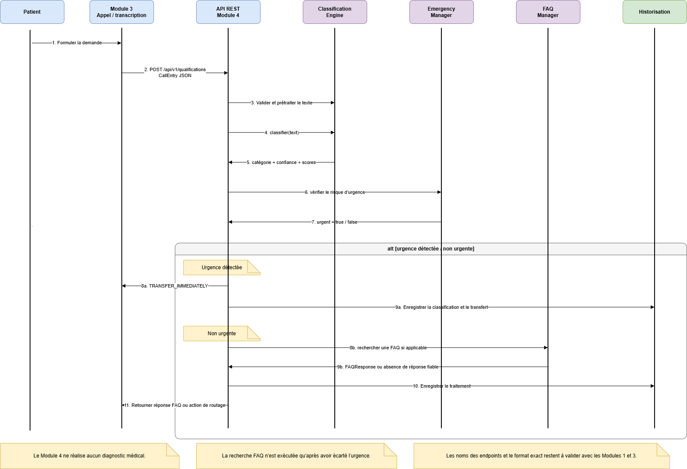

# Diagramme de séquence de classification

## 1. Objectif

Ce document présente les échanges entre les différents composants pendant
le traitement d’une demande par le Module 4 — Qualification des appels et FAQ.

Le scénario commence lorsqu’une transcription est envoyée par le Module 3.
Le Module 4 valide ensuite la demande, exécute la classification, vérifie le
risque d’urgence et détermine l’action adaptée.

## 2. Diagramme de séquence

*Figure — Séquence de traitement d’une demande par le Module 4.*

## 3. Participants

Le diagramme fait intervenir les composants suivants :

- le patient ;
- le Module 3 chargé de la gestion téléphonique et de la transcription ;
- l’API REST du Module 4 ;
- le service de validation ;
- le service de prétraitement ;
- le moteur de classification ;
- le gestionnaire des urgences ;
- le service de routage ;
- le gestionnaire FAQ ;
- le service d’historisation.

## 4. Déroulement principal

1. Le patient formule une demande pendant l’appel.
2. Le Module 3 transforme la parole en texte.
3. Le Module 3 transmet la demande à l’API du Module 4.
4. L’API vérifie la validité des données reçues.
5. Le texte est nettoyé et préparé.
6. Le moteur de classification détermine la catégorie et le score de confiance.
7. Le gestionnaire des urgences vérifie si la demande nécessite une prise en charge prioritaire.
8. Le service de routage détermine l’action à exécuter.
9. Le gestionnaire FAQ est interrogé uniquement lorsque la catégorie le permet.
10. Le résultat du traitement est enregistré dans l’historique.
11. La réponse ou l’action est retournée au Module 3.

## 5. Scénario d’urgence

Lorsqu’une urgence potentielle est détectée :

1. le traitement normal est interrompu ;
2. aucune recherche FAQ n’est exécutée ;
3. l’action `TRANSFER_IMMEDIATELY` est retournée ;
4. le traitement est enregistré dans l’historique ;
5. le Module 3 exécute techniquement le transfert.

## 6. Scénario FAQ

Lorsqu’une demande peut être traitée par la FAQ :

1. le service de routage transmet la demande au gestionnaire FAQ ;
2. le gestionnaire recherche uniquement dans les FAQ actives ;
3. une réponse est retournée si la similarité est suffisante ;
4. sinon, l’action `TRANSFER_TO_HUMAN` est retournée.

## 7. Points à valider

- Les échanges exacts avec le Module 3.
- L’ordre définitif des appels internes.
- Le mécanisme d’historisation.
- La gestion des erreurs entre les composants.
- Le comportement lorsque le classificateur ou la FAQ est indisponible.